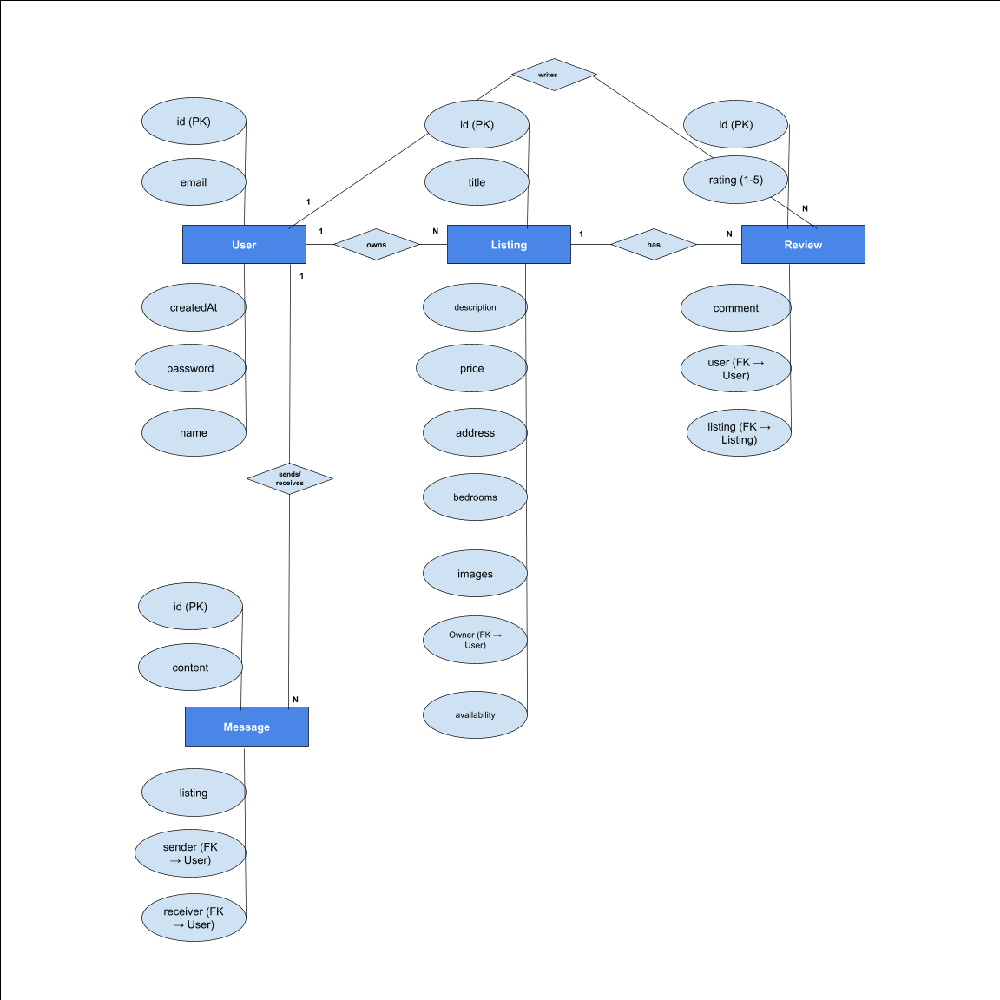

# BruinLease: UCLA Housing Marketplace

BruinLease is a secure, full-stack MERN (MongoDB, Express, React, Node.js) application designed to facilitate short-term housing leases and sublets specifically for the UCLA community.

## Key Features

- **Secure Authentication**: JWT-based authentication with email validation for the @ucla.edu domain.
- **Listings Management**: Full CRUD (Create, Read, Update, Delete) operations for housing listings.
- **Messaging Subsystem**: Peer-to-peer communication between users and listing owners.
- **Reviews & Ratings**: User-to-user review system to build trust and reputation.
- **Security Focused**: Comprehensive input sanitization against XSS and injection attacks.
- **Image Storage**: Base64 encoding of compressed images stored directly in MongoDB (design trade-off for zero external storage cost).

## Architecture Overview

The system follows a standard Client-Server architecture, utilizing the MERN stack for development agility and consistency.

### 1. Client-Server Architecture

This architecture illustrates the separation of concerns between the React frontend, the Node/Express API, and the MongoDB database cluster, highlighting the secure communication flow using JWTs. {INSERT DIAGRAM - PLACEHOLDER}

| Component | Technology | Responsibility |
|-----------|------------|----------------|
| **Client** | React | Renders UI, manages component state, and handles image compression/Base64 encoding. Communicates via RESTful API calls. |
| **API Server** | Node.js / Express | **(Middleware)** Authenticates JWTs, enforces Least Privilege. **(Controllers)** Executes business logic, performs input validation/sanitization. **(Routes)** Maps endpoints to controller functions. |
| **Database** | MongoDB / Mongoose | Persistent storage for Users, Listings, Reviews, and Messages. Mongoose models enforce schema integrity and use parameterized queries. |
| **Connectors** | HTTP/REST (JSON) | Primary communication method. All protected requests include a JWT in the `Authorization: Bearer` header. |

### 2. Entity-Relationship Diagram (ERD)

This diagram details the core data entities and their relationships within the MongoDB database, reflecting the Mongoose schemas defined in the `backend/models` directory. 

<p align="center">
  
</p>

| Entity | Key Fields | Relationships |
|--------|------------|---------------|
| **User** | `_id` (Primary Key), `email` (Unique), `password` (Hashed) | Owns (1-to-N) Listings; Authors (1-to-N) Reviews; Sends/Receives (N-to-N) Messages. |
| **Listing** | `_id` (PK), `title`, `price`, `images` (Base64 array), `owner` (Reference to User) | Is Owned by (N-to-1) User; Has (1-to-N) Reviews. |
| **Review** | `_id` (PK), `rating`, `author` (Reference to User), `listing` (Reference to Listing) | Referenced by Listing (1-to-N); Referenced by User (1-to-N). |
| **Message** | `_id` (PK), `sender` (Reference to User), `recipient` (Reference to User), `content` | Linked to two Users (N-to-1 for Sender/Recipient). |

## Local Setup and Installation

This project is a monorepo structure containing separate frontend and backend applications. Both must be run concurrently.

### Prerequisites

- Node.js (v18.x or higher)
- npm (v8.x or higher)
- MongoDB Instance (Local or MongoDB Atlas)

### Step 1: Environment Configuration

**Clone the Repository:**
```bash
git clone [YOUR_REPO_URL]
cd bruinlease
```

**Create .env Files:**

Create a file named `.env` in the root of the `backend/` directory:
```env
# backend/.env file
NODE_ENV=development
PORT=5001
MONGO_URI=mongodb+srv://<USERNAME>:<PASSWORD>@<CLUSTER_URL>/bruinlease?retryWrites=true&w=majority
JWT_SECRET=<YOUR_LONG_SECRET_KEY>
```

Replace placeholders with your MongoDB Atlas connection string and a strong secret key.

### Step 2: Backend Setup

The backend is built with Node.js and Express.

**Install Dependencies:**
```bash
cd backend
npm install
```

**Start the Server:**
```bash
npm run dev
```

The server should start on port 5001. You will see output like: `Server running in development mode on port 5001`.

### Step 3: Frontend Setup

The frontend is a React application created with Create React App.

**Install Dependencies:**
```bash
cd ../frontend
npm install
```

**Start the Client:**
```bash
npm start
```

The React application will open in your browser, typically at `http://localhost:3000`.

The frontend will automatically proxy API requests to the running backend server (`http://localhost:5001`). The application is now fully operational.

## Testing

This project utilizes **Playwright** for automated End-to-End (E2E) testing to ensure critical user workflows function correctly across the entire application stack.

### Install Playwright

If you haven't installed Playwright yet:
```bash
npm install -D playwright
npx playwright install
```

### Test Configuration

The project is configured with the following Playwright settings (defined in `playwright.config.js`):

- **Test Directory**: `./tests/e2e`
- **Execution**: Sequential (non-parallel) to avoid database conflicts
- **Workers**: 1 worker to prevent race conditions
- **Timeout**: 60 seconds per test, 15 seconds per action
- **Reporters**: HTML, List, and JSON formats
- **Browser**: Chromium (Desktop Chrome configuration, 1280x720 viewport)
- **Auto-start**: Automatically starts both backend (port 5001) and frontend (port 3000) servers before running tests
- **CI Mode**: Automatic retries (2x) and stricter validation in CI environments

### Available Test Commands

Run tests from the **root directory** of the project:

| Command | Description |
|---------|-------------|
| `npm run test:e2e` | Run all E2E tests in headless mode (default) |
| `npm run test:e2e:headed` | Run tests with browser visible (headed mode) for debugging |
| `npm run test:e2e:debug` | Run tests in debug mode with Playwright Inspector for step-by-step debugging |
| `npm run test:e2e:ui` | Launch Playwright UI mode for interactive test development and debugging |
| `npm run test:e2e:report` | Open the HTML test report from the last test run |

### Running Tests

**Basic Test Execution:**
```bash
npm run test:e2e
```

This command will:
1. Automatically start the backend server on port 5001
2. Automatically start the frontend server on port 3000
3. Run all E2E tests sequentially
4. Generate test reports in the `playwright-report` directory
5. Create JSON results in `test-results.json`

**Debug Mode:**
```bash
npm run test:e2e:debug
```

Opens the Playwright Inspector, allowing you to:
- Step through tests line by line
- Inspect element selectors in real-time
- View browser state at each step
- Debug test failures interactively

**Interactive UI Mode:**
```bash
npm run test:e2e:ui
```

Launches the Playwright Test UI for a visual testing experience with:
- Time-travel debugging through test execution
- Watch mode for test development
- Visual test picker and runner
- Detailed trace viewer

**View Test Results:**
```bash
npm run test:e2e:report
```

Opens the HTML report in your browser to view:
- Detailed test results with pass/fail status
- Execution traces for failed tests
- Screenshots captured on failure
- Videos of failed test runs (retained automatically)

### Test Suite Overview

The E2E test suite (`tests/e2e/bruinlease.spec.js`) verifies three major functional areas:

#### 1. User Authentication Flow
Tests complete user registration and login functionality:
- ✅ **Full Registration Flow**: Creates new user account with UCLA email validation
- ✅ **Logout Functionality**: Verifies session termination
- ✅ **Login Flow**: Authenticates with registered credentials
- ✅ **Email Validation**: Enforces @ucla.edu domain requirement
- ✅ **Error Handling**: Displays appropriate error messages for invalid inputs

**Test Details:**
- Validates JWT-based authentication
- Ensures password confirmation matching
- Tests form validation and error display
- Verifies redirect to dashboard after successful auth

#### 2. Listing Management Flow
Tests CRUD operations for housing listings:
- ✅ **Create Listing**: Full form submission with all required fields
- ✅ **Edit Listing**: In-place editing with real-time updates
- ✅ **Delete Listing**: Removal with confirmation dialog
- ✅ **View Listings**: Display of user's own listings
- ✅ **Form Validation**: All listing fields properly validated

**Test Details:**
- Covers complete listing lifecycle (Create, Read, Update, Delete)
- Tests multi-field forms (title, description, address, price, bedrooms, etc.)
- Validates navigation between listing pages
- Ensures proper authentication enforcement (requires login)

#### 3. Search and Filter Functionality
Tests the listing search and filtering system:
- ✅ **Text Search**: Search by listing title/keywords
- ✅ **Price Range Filter**: Min/max price filtering
- ✅ **Bedroom Filter**: Filter by number of bedrooms
- ✅ **Distance Filter**: Filter by distance from UCLA campus
- ✅ **Availability Filter**: Filter by current availability status
- ✅ **Clear Filters**: Reset all filters to default state
- ✅ **No Results Handling**: Graceful display when no listings match criteria

**Test Details:**
- Available to both authenticated users and guests
- Tests real-time filter application (500ms debounce)
- Validates filter combinations work correctly
- Ensures proper "no results" messaging